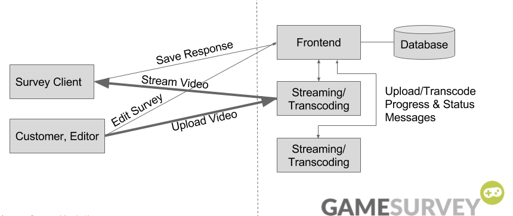

# GSurveyCode
GSurveyCode consists of two services: 

gsWeb -  provides web server and rest interfaces, talks to the database. 

gsVideo - receives file uploads, handles streaming content to clients.

This repository contains the full GameSurvey code.


##Compile
[https://gradle.org/](gradle) is used as build system.:

    gradle dist
    
Builds both services and packs them as seperates jar files.

    
##Configuration
###Web Server
```
server:
  applicationConnectors:
  - type: http
    port: 8080
  adminConnectors:
  - type: http
    port: 8081

jwtkey:

fbappID: 42
fbsecureCode: 42

#mail settings
smtpAuth: true
startTls: true
ssl: false
smtpHost: smtp.gmail.com
smtpPort: 587
username: example@gmail.com
password: password
from: example@gmail.com


database:
  # the name of your JDBC driver
  driverClass: org.postgresql.Driver
  #  # the username
  user: username
  #
  #  # the password
  password: password
  #
  url: jdbc:postgresql://127.0.0.1/gamesurvey

# Logging settings.
logging:

  # The default level of all loggers. Can be OFF, ERROR, WARN, INFO, DEBUG, TRACE, or ALL.
  level: INFO
```

###Video Server
```
videoDirName: C:\uploaded\

gsServiceURL: http://localhost:8080
jwtkey:

serverID: 1
ffmpeg:  C:\Program Files\ffmpeg\bin\ffmpeg.exe
ffprobe: C:\Program Files\ffmpeg\bin\ffprobe.exe

jerseyClient:
  timeout: 3s

server:
  applicationConnectors:
  - type: http
    port: 9000
  adminConnectors:
  - type: http
    port: 9001

# Logging settings.
logging:

# The default level of all loggers. Can be OFF, ERROR, WARN, INFO, DEBUG, TRACE, or ALL.
 level: INFO
```

##System overview



##Running GSurveyCode
    java -jar gsweb.jar server gsweb.yml
    java -jar gsvideo.jar server gsvideo.yml

